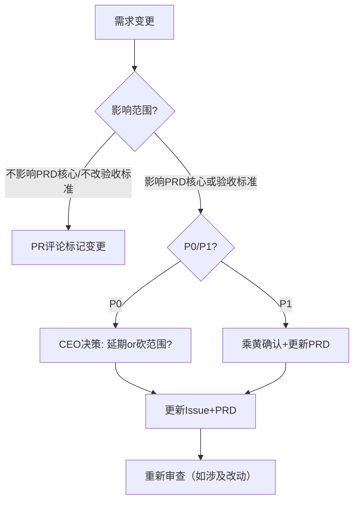

# 中韩出海数智港 · 从市场到收入的商业闭环开发SOP

**版本**: v2.0 | **编制**: 白泽（CEO拍板）| **日期**: 2026-05-05
**生效范围**: 中韩出海数智港项目 → 沉淀为标准模板 → 所有新项目复用
**蜂巢参与 (v1.0)**: 乘黄(产品) × 烛龙(技术) × 狴犴(审查)
**蜂巢参与 (v2.0)**: 商羊(市场) × 英招(销售) × 蠪侄(财务) × 鹿蜀(运营/CS) × 文鳐(秘书) × 乘黄(产品) × 烛龙(技术) × 狴犴(审查)
**蜂巢参与 (v3.0)**: 徐准(合规) × 獬豸(法律) × 商羊(市场) × 英招(销售) × 蠪侄(财务) × 鹿蜀(运营/CS) × 文鳐(秘书) × 乘黄(产品) × 烛龙(技术) × 狴犴(审查)

---

## 一、核心变革：为什么需要v3.0？

### v2.0还缺什么

| 缺失部门 | 为什么必须 | 后果 |
|:---------|:-----------|:------|
| ❌ **合规部（产品核心）** | 6位数字合规官是公司核心产品，他们不参与SOP就像卖鞋的不参与鞋子设计 | 产品卖点与客户真实合规需求脱节 |
| ❌ **专职律师** | 跨境合规平台没有内部律师把关，就像卖保险的没买保险 | 用户协议有法律漏洞、产品功能产生法律风险 |

### 全球最佳实践的启示

调研了Deel/Remote/OneTrust/KOTRA等12家公司的组织架构，核心发现：
1. **合规/法务是C-level独立职能** — 所有头部公司的General Counsel都直接向CEO汇报
2. **「合规即产品」** — OneTrust的合规团队嵌入在产品开发中，而非事后审查
3. **律师在产品规划阶段就参与**，不是开发完了才审

---

## 一、核心变革：为什么需要v2.0？

### v1.0的问题

上一版SOP只有产品+技术+审查三个部门参与讨论，本质上是「技术交付SOP」，不是「商业价值SOP」。核心缺失：

| 缺失部门 | 缺少了什么 | 后果 |
|:---------|:-----------|:------|
| ❌ 市场部 | 目标客户验证、品牌一致性、SEO、竞品分析 | 做出来的产品没人知道 |
| ❌ 销售部 | 销售场景验证、演示流程、话术测试 | 做出来的产品卖不掉 |
| ❌ 财务部 | 定价模型、成本约束、盈亏分析、支付合规 | 做出来的产品亏本 |
| ❌ 运营/客户成功 | 灰度策略、用户反馈闭环、客服流程 | 做出来没人用、没人管 |

### v2.0设计原则

1. **全职能覆盖** — 从市场洞察到收入确认，每个职能在开发流程中都有自己的门控节点
2. **各司其职** — 每个数字员工参与自己专业的环节，CEO不替他们决策
3. **门控不可跳过** — 没有市场部签字不能发布，没有销售部验收不能上线，没有财务部审批不能定价
4. **越用越聪明** — 每个员工的独立记忆库随每次参与积累经验

---

## 一、蜂巢讨论收敛表

### 争议点与CEO拍板

| 争议点 | 乘黄说 | 烛龙说 | 狴犴说 | CEO拍板 |
|:-------|:-------|:-------|:-------|:--------|
| Sprint周期 | 固定3-5天，可预期 | 按模块交付，灵活 | 同意烛龙，但要有最晚交付时间 | ✅ **折中：按模块设Deadline，模块之间最多7天。每个模块绑定一个「最晚交付日」，不按固定节奏，但按承诺交付。** |
| 没PRD能不能写代码 | 绝对不行 | 需要技术Spike前置 | 不接受没PRD的代码 | ✅ **接受烛龙的技术Spike，但Spike必须输出「技术可行性报告」作为PRD的输入，PRD写完才能正式开发。没有PRD的代码永不合并到main。** |
| 验收标准范围 | Given/When/Then功能验收够用 | 必须加技术维度（性能/安全） | 必须两层验收 | ✅ **采用双层验收：产品层Given/When/Then + 技术层非功能需求清单（性能基线/SLA/安全/日志）。两者都通过才算验收通过。** |
| PRD写多少开始开发 | 全部写完 | v0.1概要即可开始Spike | 同意烛龙 | ✅ **PRD分版本：v0.1概要(目标+范围+接口) → v0.5详细功能 → v1.0完整。开发在v0.1后启动技术Spike，v0.5后正式开发。** |
| 谁做代码审查 | 全部狴犴 | 分级审查 | 分级审查，重要部分狴犴审 | ✅ **三级审查：P0(核心/安全/支付)→狴犴强制审；P1(业务逻辑)→模块负责人审；P2(UI/样式/测试)→同行审。** |
| Sprint完不成怎么办 | 调整计划 | 目标分Must/Should/Nice | 尽早暴露 | ✅ **Sprint目标分三级：Must(必须完成)、Should(尽量完成)、Nice(锦上添花)。阻塞只影响Nice则Sprint成功。阻塞Must则触发CEO决策：延期or砍范围。** |
| 环境管理复杂度 | 简单够用 | dev/staging/prod三级 | 同意烛龙 | ✅ **维持简单：dev（本地+feature分支）+ prod（main分支）。staging在合并前由开发者本地做。** |

### 核心原则（不可协商）

1. **没有PRD的代码永不合并到main。** 技术Spike（没有PRD）只能在feature分支上做，PR到main必须有PRD。
2. **每个模块独立分支+独立PR+独立验证。** 一个PR只做一件事，互相隔离。
3. **验收分两层：产品验收+技术验收。** 产品说能用不算完，技术说安全/性能达标才算完。
4. **CI不通过不合并。** 所有自动检查（lint、test、security scan）通过后狴犴才动手审。
5. **凡涉及数据库变更，必须有migration文件。** 已合并的migration只追加不覆盖。

---

## 二、全职能统一开发时间轴

### 从市场到收入的完整流程

```
Phase 0: 市场洞察 ——— Phase 1: PRD ——— Phase 2: 技术设计 ——— Phase 3: 开发 ——— Phase 4: 审查 ——— Phase 5: 销售验收 ——— Phase 6: 发布 ——— Phase 7: 收入追踪
  主导: 市场部          主导: 产品部        主导: 技术部           主导: 技术部       主导: 审查员        主导: 销售部          主导: 运营部        主导: 财务部
  介入: CEO             介入: 全职能蜂巢    介入: 产品/市场         介入: 产品        介入: 产品/运营      介入: CEO             介入: 销售/市场     介入: CEO
```

### 8个阶段详细定义

| Phase | 名称 | 主导 | 介入部门 | 关键动作 | 产出物 | 出口门控 |
|:-----:|:-----|:----:|:---------|:---------|:-------|:---------|
| P0 | 市场洞察 | 商羊(市场) | 英招(销售)+CEO | 竞品分析、市场定位、ICP画像、渠道策略 | 市场定位白皮书+竞品分析+SEO词库 | **G0 (市场门控)** |
| P1 | PRD | 乘黄(产品) | 全职能蜂巢 | PRD编写+全职能评审 | PRD文档(v0.1→v0.5→v1.0) | **G1 (PRD门控)** |
| P2 | 技术设计 | 烛龙(技术) | 狴犴(审查)+乘黄(产品) | 技术Spike、架构设计、数据模型 | 技术方案+migration文件 | **G2 (设计门控)** |
| P3 | 开发 | 烛龙(技术) | 乘黄(产品) | 模块开发+单元测试+自检 | feature分支+代码+测试 | — |
| P4 | 审查 | 狴犴(审查) | 乘黄(产品)+鹿蜀(运营) | 代码审查+产品验收+运营验证 | PR (Approved) | **G4 (审查门控)** |
| P5 | 销售验收 | 英招(销售) | 鹿蜀(运营)+乘黄(产品) | 销售演示验证+话术测试+客户反馈 | 销售验收报告 | **G5 (销售门控)** |
| P6 | 发布 | 鹿蜀(运营) | 英招(销售)+商羊(市场) | 灰度发布+上线通知+市场推广 | 生产环境+发布公告 | **G6 (发布门控)** |
| P7 | 收入追踪 | 蠪侄(财务) | 英招(销售)+CEO | 收入确认+对账+盈亏分析+迭代反馈 | 财务报告+迭代建议 | **G7 (财务门控)** |

### 门控总览

| 门控 | 名称 | 负责部门 | 会签部门 | 关键检查 | 不通过后果 |
|:----:|:-----|:---------|:---------|:---------|:-----------|
| G0 | 市场门控 | 商羊(市场) | 徐准(合规产品)+白泽 | 竞品分析、市场定位、ICP | 不能进入PRD |
| G1 | PRD门控 | 乘黄(产品) | 徐准(合规)+獬豸(法律) | PRD完整+合规会签+法律审 | 不能进入技术设计 |
| G2 | 设计门控 | 烛龙(技术) | 狴犴+刘真(数据合规) | 技术Spike+数据合规审查 | 不能开发 |
| G4 | 审查门控 | 狴犴(审查) | 乘黄(产品)+獬豸(法律) | CI通过+代码审查+法律审 | 不能合并到main |
| G5 | 销售门控 | 英招(销售) | 孰湖(合同)+鹿蜀(CS) | 演示OK+合同模板就绪 | 不能发布 |
| G6 | 发布门控 | 鹿蜀(运营) | 商羊(市场)+慧珍(运营) | 灰度策略+上线物料+市场ready | 不能上线 |
| G7 | 财务门控 | 蠪侄(财务) | 犀渠(跨境)+英招(销售) | 定价模型+支付合规+收入确认 | 不计收入 |

**PRD结构**（不可省略的章节）：

```
# PRD-{序号}-{模块简称}

## 1. 产品概述
- 一句话定位 + 目标用户 + 核心痛点
- 关联的北极星维度（如C商业化/B数字员工）
- 预期影响（完成度提升X%、健康度提升Y%）

## 2. 功能规格
- 用户故事: As a [角色], I want [功能], So that [价值]
- 界面描述/交互逻辑（前端改动需附截图或描述）

## 3. 验收标准（双层）
### 产品层（Given/When/Then）
- Scenario 1: 正常流程
- Scenario 2: 异常流程
- Scenario 3: 边界条件

### 技术层（非功能需求）
- [ ] 性能基线: P95响应时间 <= Xms
- [ ] 安全合规: OWASP Top 10检查无高风险项
- [ ] 错误处理: 所有API返回统一错误格式
- [ ] 日志: 关键路径有info日志，错误有error日志
- [ ] 数据库变更: 有migration文件（如涉及）

## 4. 技术风险
- [ ] 已知技术阻塞项（依赖/环境/性能瓶颈）
- [ ] 技术不确定项（需Spike验证）
- [ ] Fallback方案（此路不通时）

## 5. 依赖关系
- 前置模块
- 阻塞模块
- 数据依赖

## 6. 不做清单
- 这个模块明确不做什么（管理预期）
```

**存放位置**：
```
中韩出海数智港/PRD/
├── PRD-index.md           ← 所有PRD清单及状态
├── PRD-001-XX.md
└── PRD-002-XX.md
```

**Gate 1 通过条件**：PRD包含全部章节，CEO审核签字

---

### 第3步：Issue创建（Gate 2 — 任务拆解完成）

**谁做**：乘黄(产品经理)

**做什么**：
- 将PRD拆解为GitHub Issues
- 每个Issue对应一个独立可交付的模块

**Issue模板**：
```markdown
## 背景
- PRD: PRD-001-数字员工展示区
- 北极星维度: B数字员工（25%权重）

## 需求描述
{PRD中的功能规格摘要}

## 验收标准
- {产品层验收标准}
- {技术层验收标准}

## 预估工作量
{S/M/L/XL}

## Label
- module: {模块名}
- phase: {phase-1/2/3}
- priority: {p0/p1/p2}
```

**Gate 2 通过条件**：所有Issue创建完毕，关联PRD引用

---

### 第4步：分支与开发（Gate 3 — 技术方案完成）

**谁做**：烛龙(工程师)

**分支策略**：
```
{type}/{prd编号}-{kebab-case简述}
例如: feat/prd001-digital-employee-card
      fix/issue42-login-error
      chore/ci-github-actions
```

**开发前确认**：
- 技术方案是否清晰？不确定的做技术Spike（最多2天）
- 数据库变更是否涉及？涉及则创建migration文件
- 测试方案是否确定？

**开发原则**：
- 遵循 incremental-impl：薄垂直切片，每片~100行
- 每次commit至少「编译通过」或「功能可测」
- 代码风格自检：lint工具检查通过

**技术Spike规范**（PRD前的技术验证）：
```markdown
## Spike目标
验证WebSocket在现有环境是否可行

## 时间限制
2天（到期不管结果，必须输出报告）

## 输出
技术可行性报告（包含：可用的方案/不可行的原因/替代方案建议）
```

**Gate 3 通过条件**：功能分支创建，技术方案确认

---

### 第5步：PR提交（Gate 4 — 验证就绪）

**谁做**：烛龙(工程师)

**PR流程**：
```bash
# 确保从最新main起分支
git checkout main && git pull origin main
git checkout -b feat/prd001-xxx

# 开发 + 提交（使用conventional commit格式）
git commit -m "feat(prd001): add digital employee card component

- 添加数字员工信息卡片组件
- 支持头像/姓名/角色/能力标签展示
- PRD-001 Section 2.1-2.3

Closes #23"

# 推送
git push -u origin HEAD
```

**PR模板**（功能型）：
```markdown
## PRD
PRD-001-数字员工展示区 (L3工作室/出海项目/中韩出海数智港/PRD/PRD-001.md)

## Issue
Closes #23

## 变更摘要
{列举改动内容}

## 产品验收清单
- [ ] Scenario 1: 正常展示6位数字员工 → 确认
- [ ] Scenario 2: 点击某位员工展示详情 → 确认
- [ ] Scenario 3: 移动端响应式 → 确认

## 技术验收清单
- [ ] API响应时间 < 200ms
- [ ] 无新增安全漏洞
- [ ] 数据访问已加日志

## 截图（前端必填）
{截图}

## 数据库变更
- [ ] 无
- [ ] 有（见 migration/XXX.sql）
```

**Gate 4 通过条件**：PR描述完整，CI自动检查触发

---

### 第6步：审查与验证（Gate 5 — 质量通过）

**谁做**：审查按级别分派 + CI自动执行

**三级审查制**：

| 级别 | 适用场景 | 审查员 | 标准 |
|:----:|:---------|:-------|:-----|
| P0 | 核心功能/安全敏感/支付 | 狴犴(强制) | 全部checklist过完 |
| P1 | 正常业务逻辑 | 模块负责人 | 架构正确 + 逻辑无bug |
| P2 | 样式/测试/文档/配置 | 同行审查 | 功能性正确 |

**代码审查Checklist**（狴犴版）：

```markdown
## 架构正确性
- [ ] 新增模块符合现有架构风格？
- [ ] 没有引入不必要的依赖？
- [ ] 没有重复造轮子？

## 安全性
- [ ] 没有硬编码密码/密钥/Token？
- [ ] 用户输入做了校验/清洗？
- [ ] API权限控制正确？
- [ ] SQL注入防护到位？

## 可维护性
- [ ] 命名清晰，符合项目约定？
- [ ] 函数/方法不超过50行？
- [ ] 有必要的注释（为什么做，而不是做什么）？
- [ ] 没有死代码/注释掉的代码？

## 错误处理
- [ ] 所有外部调用有try-catch？
- [ ] 错误信息不泄露敏感信息？
- [ ] 关键路径有日志记录？

## 测试
- [ ] 核心逻辑有测试覆盖？
- [ ] PR包含了回归测试？
- [ ] 测试不是"只是为了通过"？

## 数据库变更（如涉及）
- [ ] migration文件不可逆？已考虑降级？
- [ ] 旧数据兼容性？
```

**审查结果标准**：

| 结果 | 条件 | 后续 |
|:-----|:------|:------|
| ✅ Approved | 无BLOCKER/MAJOR问题 | 可合并 |
| ⏳ Conditional | 有MAJOR但不影响核心功能，已在PR评论中标记 | 修复后可直接合并 |
| ❌ Changes requested | 有BLOCKER问题 | 退回修改，重新审查 |

**Gate 5 通过条件**：狴犴/模块负责人Approved + CI全绿 + 无BLOCKER问题

---

### 第7步：合并与发布（Gate 6 — 交付完成）

**谁做**：烛龙(合并) + 乘黄(验收确认)

**合并规范**：
- 合并方式: **Squash and merge**（保持main历史整洁）
- 合并前: 乘黄在dev环境做最终产品验收
- 合并后: 自动部署到生产环境（后期通过GitHub Actions）

**合并要求**（必须全部满足）：
```markdown
□ CI全部通过
□ 狴犴/模块负责人 Approved
□ 乘黄产品验收通过
□ 无开放的MAJOR/BLOCKER评论
□ PR描述完整
```

**发布检查清单**：
```markdown
□ 数据库migration已执行（如涉及）
□ .env配置已更新
□ SSL证书有效
□ 安全规则（deny规则）已确认
□ 回滚方案已准备
```

**Gate 6 通过条件**：合并到main，生产环境验证通过

---

## 三、验证标准总览

| 门控 | 谁负责 | 通过条件 | 违反后果 |
|:----:|:-------|:---------|:---------|
| Gate 0 三要素 | 白泽 | 目标/标准/交付物清晰 | 不进入PRD阶段 |
| Gate 1 PRD完成 | 乘黄→白泽 | 全部章节+CEO签字 | 开不了Issue |
| Gate 2 Issue就绪 | 乘黄 | 关联PRD+验收标准+预估 | 不开分支 |
| Gate 3 技术方案 | 烛龙 | 分支创建+技术确认 | 不开PR |
| Gate 4 PR提交 | 烛龙 | PR描述完整+CI触发 | 不进入审查 |
| Gate 5 审查通过 | 狴犴/负责人 | Approved+CI绿+无BLOCKER | 不合入main |
| Gate 6 交付完成 | 烛龙→乘黄 | 合并+生产验证 | 回滚 |

---

## 四、GitHub管理规范

### 仓库结构
```
china-korea-digital-port/
├── .github/
│   ├── PULL_REQUEST_TEMPLATE/
│   │   └── feature.md          ← PR模板（功能型）
│   ├── ISSUE_TEMPLATE/
│   │   ├── feature-request.md  ← Issue模板（功能）
│   │   └── bug-report.md       ← Issue模板（Bug）
│   └── workflows/
│       └── ci.yml              ← CI配置（lint+test+security）
├── backend/
├── deploy/
├── PRD/                        ← PRD文档（与代码同仓库）
│   ├── PRD-index.md
│   └── PRD-001-*.md
├── migrations/                  ← 数据库变更
│   ├── 001_*.sql
│   └── 002_*.sql
└── ...
```

### Label规范
```
module: {模块名}          — 模块归属
phase: phase-{1/2/3}     — 阶段划分
priority: p{0/1/2}       — 优先级
type: bug/feature/enhance — 类型
status: blocked/ready     — 状态
```

### Branch Protection Rules（main分支）
- ✅ Require a pull request before merging
- ✅ Require approvals (至少1人)
- ✅ Dismiss stale pull request approvals when new commits are pushed
- ✅ Require status checks to pass before merging
- ✅ Require branches to be up to date
- ✅ Do not allow bypassing the above settings

---

## 五、变更管理流程

当需求在开发过程中发生变更时：



**变更记录**：
- 每次变更在PRD文档末尾追加变更日志
- 变更日志格式：`YYYY-MM-DD | {变更描述} | {决策人} | {原因}`

---

## 六、首次启动检查清单（从中韩出海数智港开始）

### 初始化步骤

- [ ] 在GitHub仓库中配置Branch Protection Rules
- [ ] 创建 `.github/PULL_REQUEST_TEMPLATE/feature.md`
- [ ] 创建 `.github/ISSUE_TEMPLATE/feature-request.md` 和 `bug-report.md`
- [ ] 创建 `migrations/` 目录 + `migrations/README.md`
- [ ] 在项目根目录创建 `PRD/PRD-index.md`
- [ ] 将PRD文档纳入Git（与代码同仓库）
- [ ] 配置CI（GitHub Actions）：lint + 简单测试 + 安全检查

---

## 七、与现有铁律的关系

| 铁律 | 对应SOP环节 |
|:-----|:------------|
| 铁律一（CEO不动手） | 所有开发/审查/验证执行 → 派数字员工 |
| 铁律十三（三要素确认） | Gate 0三要素确认 |
| 铁律十四（交付四问自检） | Gate 6交付前自检 |
| 铁律十六（合成产品分层） | PRD中标注北极星维度关联 |
| 蜂巢讨论强制执行器 | 重要决策/模糊需求 → 启动蜂巢 |

---

## 八、SOP迭代规则

1. 本SOP从「中韩出海数智港」项目开始实践
2. 每次完成一个模块后，团队复盘SOP执行情况
3. 发现不适用的规则 → 记录到SOP附录「待修改」
4. 每完成3个模块后 → SOP版本号+0.1
5. 当SOP稳定运行10个模块以上 → 提取为通用模板，供所有新项目使用

---

## 附录A：快速参考

### 一条命令完成标准开发

```bash
# 1. 读PRD → 确认需求
# 2. 创建分支
git checkout main && git pull origin main && git checkout -b feat/prd001-xxx

# 3. 开发（用write_file/patch改代码）

# 4. 提交
git add -A && git commit -m "feat(prd001): description (#issue)"

# 5. 推送 + 创建PR
git push -u origin HEAD
# → 在GitHub创建PR，填写模板
# → 等待CI + 审查 + 验收 → 合并
```

### 每个模块的交付物清单

```
□ PRD文档（已审核）
□ GitHub Issue（已关联PRD）
□ Feature分支（已从main创建）
□ 代码改动（已提交）
□ PR（已填写模板）
□ CI通过（全绿）
□ 审查通过（Approved）
□ 产品验收通过（乘黄确认）
□ 合并到main
□ 生产验证通过
```
logout
